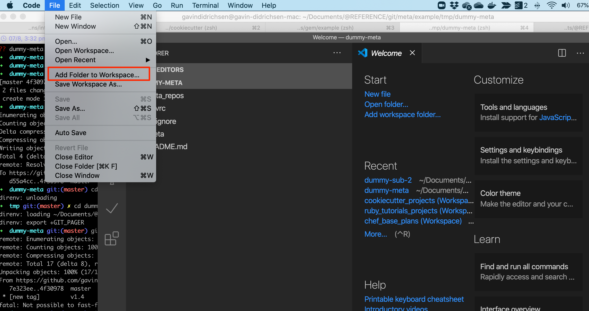
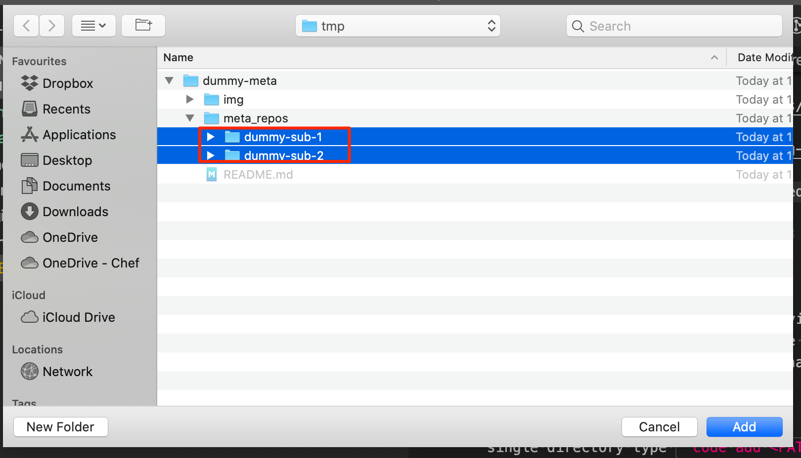

# dummy-meta

## Pre-Requisites

* Install [meta](https://github.com/mateodelnorte/meta#readme).
* Ensure direnv/.envrc is enabled on target machine
* Clone the current repository.
* OPTIONAL if using vscode: Ensure 'gitlens' is installed

## Setup

## Required

Run ``meta git update``.  This will initialize the current meta repository cloning all other repositories required.

Ensure [direnv](https://direnv.net) is installed and configured for the current environment.

Ensure git 'paging' is turned off for the current environment.  See [here](https://stackoverflow.com/questions/2183900/how-do-i-prevent-git-diff-from-using-a-pager) for more information.  The "export GIT_PAGER=cat" has been added to the .envrc file to enable this across all git commands.

### Optional

If using vscode, open the workspace at the root directory ``code dummy-meta.code-workspace``.  This will automatically display the sub-repositories.  All sub-repositories should now be visible.  The 'gitlens' extension will show any changes in the sub-repositories.  See the Appendix for how to add new sub-repositories to the current workspace

# Appendix

## Common meta commands

### Create new local/remote branch

To do this across all repositories, parent and sub-repositories:

```bash
meta git checkout -b gavindidrichsen/myfeature
# NOTE: if you don't want the branch on the parent repository,
# make sure to return to 'master' and delete the 'gavindidrichsen/myfeature' branch
# before doing the next step
meta git push origin gavindidrichsen/myfeature
```

### Tag all repositories

List all git tags.
```bash
➜  dummy-meta git:(master) ✗ meta git tag --list

/Users/gavindidrichsen/Documents/@REFERENCE/git/meta/example/dummy-meta:
v1.4
/Users/gavindidrichsen/Documents/@REFERENCE/git/meta/example/dummy-meta ✓

meta_repos/dummy-sub-1:
v1.4
meta_repos/dummy-sub-1 ✓

meta_repos/dummy-sub-2:
v1.4
meta_repos/dummy-sub-2 ✓
➜  dummy-meta git:(master) ✗
```

## How to add sub-repositories to the vscode workspace

In vscode from top level directory in a terminal, add all the sub-folders to the current workspace:





## Detailed meta initialization

Before initializing the current meta repository, the directory structure will look something like:

```bash
➜  dummy-meta git:(master) tree .
.
└── dummy-meta
    └── README.md

1 directory, 1 file
➜  tmp git:(master) ✗
```

However, after running ``meta git update``, all repositories required for the meta project will also be cloned.  For example:

```bash
➜  dummy-meta git:(master) meta git update

*** the following repositories have been added to .meta but are not currently cloned locally:
*** {
  'meta_repos/dummy-sub-1': 'https://github.com/gavindidrichsen/dummy-sub-1.git',
  'meta_repos/dummy-sub-2': 'https://github.com/gavindidrichsen/dummy-sub-2.git'
}
*** type 'meta git update' to correct.

/Users/gavindidrichsen/Documents/@REFERENCE/git/meta/example/tmp/dummy-meta/meta_repos/dummy-sub-2:
Cloning into 'meta_repos/dummy-sub-2'...
remote: Enumerating objects: 3, done.
remote: Counting objects: 100% (3/3), done.
remote: Total 3 (delta 0), reused 0 (delta 0), pack-reused 0
Unpacking objects: 100% (3/3), done.
/Users/gavindidrichsen/Documents/@REFERENCE/git/meta/example/tmp/dummy-meta/meta_repos/dummy-sub-2 ✓

/Users/gavindidrichsen/Documents/@REFERENCE/git/meta/example/tmp/dummy-meta/meta_repos/dummy-sub-1:
Cloning into 'meta_repos/dummy-sub-1'...
remote: Enumerating objects: 3, done.
remote: Counting objects: 100% (3/3), done.
remote: Total 3 (delta 0), reused 0 (delta 0), pack-reused 0
Unpacking objects: 100% (3/3), done.
/Users/gavindidrichsen/Documents/@REFERENCE/git/meta/example/tmp/dummy-meta/meta_repos/dummy-sub-1 ✓
➜  dummy-meta git:(master)
```

So that the new directory structure will look something like this:

```bash
➜  dummy-meta git:(master) tree .
.
├── README.md
└── meta_repos
    ├── dummy-sub-1
    │   └── README.md
    └── dummy-sub-2
        └── README.md

3 directories, 3 files
```